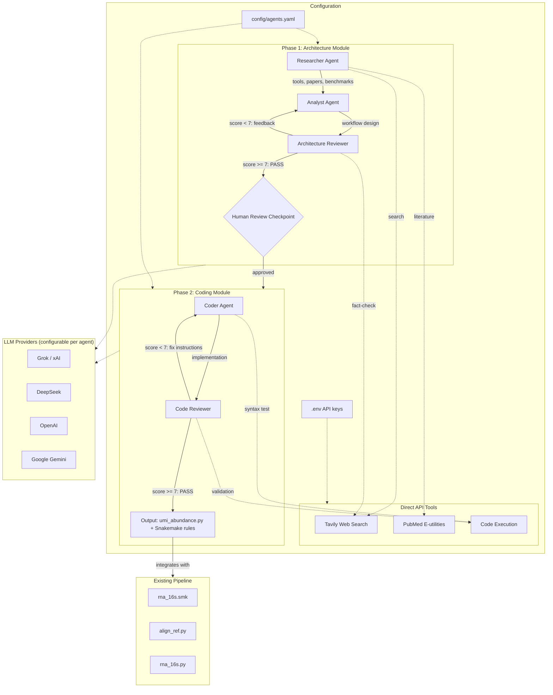
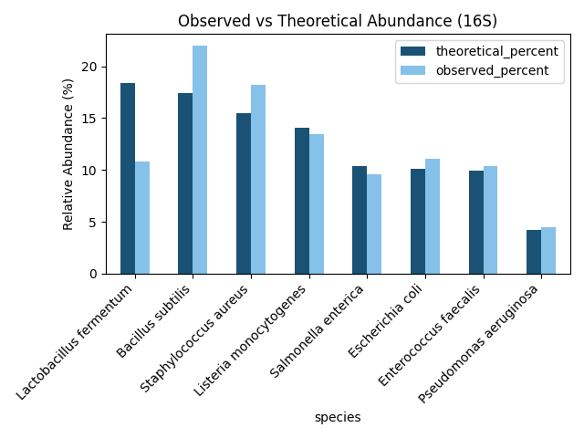

## UMI 16S rRNA Architect
To build a new project of 16S rRNA from scratch, I created this multi-agent tool to gether domain knowledge and architect project. There are 2 modules: 
1. multi_agent_architect: a multi-agent general purpose LLM planer for automated workflow architecture design, review and code generation.  
2. rna_16s: applied the multi_agent_architect to create a actual bioinformatics pipeline implementation (Snakemake workflow + Python scripts). 

## Step1. Multi_agent_architecture  

I had no previous knowledge on 16S rRNA data analysis, so the first step is to gether domain knowledge and architect a workflow. This module is a automated workflow design and code generation powered by a multi-agent LLM system with CrewAI orchestration and direct API tool integration.    

**Keywords:** Multi-Agent Systems, CrewAI, LLM, literature search and decision making

### Architecture



The system operates in two phases with a human review checkpoint:

**Phase 1 -- Architecture Module** (Researcher -> Analyst -> Reviewer)
1. **Researcher Agent** searches Tavily and PubMed for latest tools/papers on UMI-based 16S clustering.
2. **Analyst Agent** designs a step-by-step bioinformatics workflow based on findings.
3. **Architecture Reviewer** scores the design (0-10) and triggers revision if below threshold.

**Human Review Checkpoint** -- User reviews the approved architecture before proceeding.

**Phase 2 -- Coding Module** (Coder -> code-Reviewer)
4. **Coder Agent** implements the approved workflow as Python code, integrating with existing `rna_16s.smk`.
5. **Code Reviewer** validates syntax, logic, edge cases, and integration. Iterates until quality threshold met.

Each agent's LLM provider is independently configurable (Grok, DeepSeek, OpenAI, Gemini) via `config/agents.yaml`.

---

### Results

#### Phase 1: Architecture Design

```bash
cd multi_agent_architect/src
python main.py --phase architecture \
    --task "UMI-based 16S rRNA clustering for metatranscriptomic abundance"
```

- **Input:** Task description (natural language)
- **Output:** `outputs/architecture_YYYYMMDD_HHMMSS.md` -- structured workflow design with tool recommendations, per-step I/O specifications, and integration plan.

#### Phase 2: Code Generation

```bash
cd multi_agent_architect/src
python main.py --phase coding \
    --architecture outputs/architecture_YYYYMMDD_HHMMSS.json
```

- **Input:** Approved architecture document
- **Output:** `outputs/coding_YYYYMMDD_HHMMSS.md` -- implementation code (umi_abundance.py, Snakemake rules, requirements)

#### Full Pipeline (with interactive checkpoint)

```bash
cd multi_agent_architect/src
python main.py --phase all
```

Runs Phase 1, pauses for human review, then proceeds to Phase 2.

---

### Materials and Methods

#### Data Context

| Component | Description |
|-----------|-------------|
| Input data | UMI-tagged NGS reads (FASTQ), 16S rRNA amplicons |
| Existing pipeline | `rna_16s.smk` -- Snakemake workflow for meta denovo, align to ref, frag denovo |
| Reference | ZymoBIOMICS 16S standard community (8 bacterial species) |
| Abundance ground truth | Zymo theoretical composition for benchmarking |

#### Tools and Algorithms

| Component | Tool | Why this choice |
|-----------|------|-----------------|
| Agent orchestration | [CrewAI](https://github.com/crewai/crewai) | Role-based agents with built-in delegation, reflection loops, and episodic memory. Best fit for structured sequential tasks with iterative quality control |
| Web search | [Tavily](https://tavily.com/) | AI-synthesized web search with source attribution. Direct API call (not through CrewAI) for reliability |
| Literature search | [PubMed E-utilities](https://www.ncbi.nlm.nih.gov/books/NBK25500/) | Direct XML API to NCBI. Structured article metadata (PMID, abstract, authors) |
| Default LLM | [Grok](https://x.ai/) (xAI) | Strong searching, web-grounded, OpenAI-compatible API. Configurable per agent |


#### Multi-Agent Architecture

The hybrid architecture combines CrewAI for agent lifecycle management with direct HTTP API calls for tool integration:

- **CrewAI layer** -- Agent role/goal/backstory definitions, task sequencing, memory persistence, delegation control.
- **Direct API layer** -- Tavily and PubMed search functions bypass CrewAI's built-in tool system for more control over request formatting, error handling, and response parsing.
- **LLM abstraction** -- `config.py` provides a unified `call_llm()` function that dispatches to the correct provider based on per-agent configuration. This eliminates shared blind spots when using different LLMs for generation vs review.

#### Anti-Degradation Measures

| Strategy | Implementation |
|----------|----------------|
| Episodic memory | CrewAI built-in memory across tasks within a crew |
| Reviewer reflection loop | Architecture Reviewer and Code Reviewer trigger re-runs if quality score < 7.0 |
| Configurable LLM diversity | Different agents can use different LLM providers to reduce shared failure modes |
| Structured output format | Tasks specify `expected_output` to constrain agent responses |
| State summarization | Reviewer produces structured scores + specific feedback per iteration |

---

### Setup

1. Install dependencies:
   ```bash
   pip install -r requirements.txt
   ```

2. Configure API keys -- copy `.env.example` to `.env`:
   ```
   GROK_API_KEY=xai-your-key
   TAVILY_API_KEY=tvly-your-key
   PUBMED_EMAIL=your.email@example.com
   ```

3. (Optional) Customize agent LLMs in `config/agents.yaml`.

---

### Project Structure

```
agentic_bioArchitecturer/
├── multi_agent_architect/           # Module 1: Multi-agent LLM system
│   ├── config/
│   │   └── agents.yaml             # Agent roles, LLM config, tool settings
│   ├── src/
│   │   ├── main.py                 # Entry point (--phase architecture|coding|all)
│   │   ├── config.py               # API key management, LLM dispatch
│   │   ├── tools/
│   │   │   ├── tavily_search.py    # Tavily web search (direct API)
│   │   │   └── pubmed_search.py    # PubMed E-utilities (direct API)
│   │   └── crews/
│   │       ├── architecture_crew.py # Phase 1: Researcher + Analyst + Reviewer
│   │       └── coding_crew.py       # Phase 2: Coder + code-Reviewer
│   ├── outputs/                     # Generated architecture docs and code
│   ├── requirements.txt
│   └── .env.example
├── rna_16s/                         # Module 2: 16S rRNA Snakemake pipeline
│   ├── rna_16s.smk                  # Snakemake workflow (4 methods)
│   ├── perUMI_denovo.smk            # Method 4: per-UMI MEGAHIT assembly (included by rna_16s.smk)
│   ├── rna_16s.py                   # Core analysis functions
│   ├── align_ref.py                 # Reference alignment & abundance calculation
│   ├── bc2fq.py                     # Barcode-to-FASTQ extraction
│   ├── get_max_fa.py                # Select longest contig per barcode/UMI
│   ├── group_reads_by_umi.py        # Group PE reads by BX:Z: UMI tag
│   ├── per_umi_megahit_consensus.py # MEGAHIT de novo per UMI (parallel)
│   ├── consensus_per_umi.py         # Post-assembly contig QC and length filtering
│   └── config.yaml                  # Pipeline configuration (samples, params, modules)
├── outputs/                         # Final results (plots, tables)
├── docs/
│   ├── 16s_Workflow.md              # Detailed workflow notes
│   ├── plan.md                      # Development plan and decisions
│   └── flowchart.mmd               # Mermaid architecture diagram
├── README.md
└── README_CN.md
```

---

### Discussion

#### Why Multi-Agent over Single-Agent

A single LLM call cannot reliably perform the full loop of literature search, workflow design, code generation, and quality review. Each sub-task requires different expertise, tool access, and evaluation criteria. The multi-agent approach:

- **Separates concerns** -- Researcher focuses on search quality, Analyst on design coherence, Reviewer on scientific rigor.
- **Enables iterative refinement** -- Reviewer feedback loops prevent first-pass errors from propagating.
- **Human-in-the-loop** -- The checkpoint between Phase 1 and Phase 2 prevents wasted compute on flawed architectures.

#### Why CrewAI over Swarm

| Dimension | CrewAI | OpenAI Swarm |
|-----------|--------|--------------|
| **Task structure** | Role-based sequential/hierarchical | Dynamic handoff, decentralized |
| **Reflection** | Built-in reviewer loop | Manual implementation |
| **Memory** | Episodic memory built-in | No built-in memory |
| **LLM flexibility** | Any provider (Grok, DeepSeek, OpenAI, Gemini) | OpenAI only |
| **Best fit** | Structured research-design-code-review chains | Exploratory, parallel micro-agents |
| **Production readiness** | Mature (45k+ GitHub stars, 2026) | Experimental |

This project's workflow is inherently sequential and role-structured (research -> design -> review -> code -> review). CrewAI's role-based agent model and built-in reflection loops are a natural fit. Swarm's decentralized handoff model is better suited for open-ended exploration or parallel database queries -- a potential future extension for the Researcher agent.

#### Ongoing Work

- [ ] End-to-end test with real UMI 16S FASTQ data
- [ ] Benchmark generated pipeline against manual DADA2+UMI-tools workflow
- [ ] Add RAG layer (FAISS) for persistent literature context across runs
- [ ] LangGraph migration for stateful checkpointing across sessions
- [ ] Parallel Researcher sub-agents (Swarm-style) for multi-database search

---

## Step2. 16S rRNA workflow

Harnessing architect from step1 and domain knowledge from additional LLM search, I build this 16S rRNA metatranscriptomics diversity sequencing analysis project supporting three analysis methods. 

### Background

16S rRNA amplicon sequencing is the standard method for microbial community profiling. When combined with UMI (Unique Molecular Identifiers), PCR amplification bias can be corrected, improving clustering accuracy and abundance estimation -- particularly important in metatranscriptomics where transcript-level quantification captures active microbial populations.

Traditional tools (DADA2, Mothur, QIIME2) handle clustering and taxonomy assignment well, but integrating UMI deduplication into the workflow requires specialized tools (UMI-tools, UMI-nea) and careful parameter tuning. This project uses a multi-agent LLM system to automate the research, design, and implementation of such a pipeline.

This analysis workflow (`rna_16s.smk`) supports four methods: meta denovo assembly, reference alignment, fragment denovo assembly, and per-UMI de novo assembly for full-length 16S.

**Keywords:** UMI, 16S rRNA, Metatranscriptomics, Microbial Abundance. 

---

### Results and Impact

The pipeline enables microbial community profiling through four complementary approaches:

1. **Meta De Novo** -- Metagenome assembly using MetaSPAdes for species annotation via Kraken
2. **Align to Ref** -- Reference-based alignment against ZymoBIOMICS 16S standard community for species identification.  

3. **Frag De Novo** -- Fragment-based assembly leveraging stLFR co-barcodes (BX tag), grouping reads by barcode → per-barcode SPAdes assembly → longest contig selection
4. **Per-UMI De Novo** (new) -- Full-length 16S reconstruction for PE150 data. Each UMI (BX tag, 15bp) represents a single 16S molecule. MEGAHIT assembles ~50 reads/UMI at ~10x depth, producing full-length (~1500bp) consensus sequences without reference mapping.

The Per-UMI De Novo method addresses PCR amplification bias at the single-molecule level:
- MEGAHIT over SPAdes: lower startup cost, better at ~10x coverage on 1500bp, no over-correction of amplicon data
- Parallel assembly: `ThreadPoolExecutor` runs multiple UMI groups concurrently
- Length filtering: contigs < 1400bp discarded (incomplete 16S)

### Materials and Methods

#### Input and Output

| Component | Description |
|-----------|-------------|
| Input (meta/align/frag) | BAM from upstream steps `Align/{SAMPLE_ID}.sort.bam` |
| Input (per_umi_denovo) | PE150 FASTQ `data/split_read.{1,2}.fq.gz` with BX:Z: tag (15bp UMI) |
| UMI/Barcode source | BX:Z: tag in FASTQ header (same field for all methods) |
| Output (general) | QUAST assembly quality reports |
| Output (ZymoBIOMICS) | Abundance statistics comparing observed vs theoretical composition |

#### Analysis Workflow

**Method 1: Meta De Novo**
```
FASTQ → Kraken (taxonomy) → MetaSPAdes (assembly) → QUAST (evaluation)
```

**Method 2: Align to Ref**
```
FASTQ → BWA mem → SAMtools sort → idxstats → abundance calculation
Reference: ZymoBIOMICS 16S standard (8 bacterial species, ZymoBIOMICS.STD.refseq.v2.16s.fasta)
```

**Method 3: Frag De Novo**
```
BAM → group by BX:Z:barcode → filter 200-1000 reads/barcode →
bc2fq.py (extract FASTQ) → SPAdes (per-barcode assembly) →
merge contigs → QUAST + coverage analysis
```

**Method 4: Per-UMI De Novo** (full-length 16S, PE150)
```
FASTQ (BX:Z: tag) → fastp trim →
group_reads_by_umi.py (15bp UMI → per-UMI FASTQ, ≥5 reads) →
per_umi_megahit_consensus.py (MEGAHIT per UMI, parallel) →
filter ≥1400bp → merge → QUAST + Zymo abundance
```

#### Key Functions (rna_16s.py)

| Function | Purpose |
|----------|---------|
| `pct_denovoFrag_ref()` | Calculate fragment coverage vs 16S reference length |
| `coverage_bias()` | Visualize fragment coverage distribution on 16S reference |
| `per_base_density()` | Generate per-base coverage density plots |
| `merge_exon_ref()` | Merge multiple contigs into single sequence |

#### Tools and Algorithms

| Component | Tool | Rationale |
|-----------|------|-----------|
| Assembler (meta/frag) | [SPAdes](https://github.com/ablab/spades) | Versatile assembler supporting meta, rna, plasmid modes |
| Assembler (per-UMI) | [MEGAHIT](https://github.com/voutcn/megahit) | Succinct De Bruijn Graph, lower memory, better at ~10x coverage than SPAdes --isolate for amplicon data |
| Read trimming | [fastp](https://github.com/OpenGene/fastp) | Fast PE adapter trimming |
| Alignment | [BWA](http://bio-bwa.sourceforge.net/) | Fast short-read aligner for reference mapping |
| Taxonomy | [Kraken](https://ccb.jhu.edu/software/kraken/) | k-mer based taxonomic classification |
| Assembly QC | [QUAST](https://quast.sourceforge.net/) | Comprehensive assembly quality metrics |
| Reference | ZymoBIOMICS 16S | Standard mock community (8 species) with known composition |
| Clustering (downstream) | [DADA2](https://benjjneb.github.io/dada2/) | ASV-level resolution, well-benchmarked for 16S |


#### Frag De Novo Algorithm

1. **Barcode grouping** -- Extract reads from BAM by BX:Z: barcode
2. **Quality filtering** -- Select barcodes with 200-1000 reads (avoid low-coverage or PCR duplicates)
3. **Per-barcode assembly** -- Run SPAdes on each barcode's reads
4. **Contig selection** -- Keep longest contig per barcode (contigs_max.fasta)
5. **Reference alignment** -- Align contigs to ZymoBIOMICS 16S reference via minimap2
6. **Coverage calculation** -- For each fragment, compute: `frag_length / ref_16S_length`
7. **Abundance estimation** -- Compare observed coverage to theoretical Zymo composition

### Discussion

**Strengths:**
- Fragment-level assembly preserves long-range information lost in standard 16S amplicon sequencing
- Per-barcode assembly enables strain-resolved analysis in complex communities
- ZymoBIOMICS integration provides ground truth for benchmarking

**Limitations:**
- Frag De Novo requires stLFR data with BX-tagged barcodes
- Per-UMI De Novo requires ≥5 reads/UMI and ~10x depth; UMI groups with fewer reads are discarded
- Full-length 16S + PE150: reads cannot be merged, assembly required (no simple majority-vote)

**To-Do:**
- [x] Per-UMI de novo assembly (MEGAHIT, Method 4)
- [ ] End-to-end test with real UMI 16S FASTQ data
- [ ] Benchmark per-UMI contigs against ZymoBIOMICS ground truth
- [ ] Downstream DADA2/vsearch clustering on per-UMI consensus sequences
- [ ] Add RAG layer (FAISS) for persistent literature context across runs

---


### References

1. [CrewAI](https://github.com/crewai/crewai) -- Multi-agent orchestration framework
2. [UMI-tools](https://github.com/CGATOxford/UMI-tools) -- UMI extraction and deduplication
3. [DADA2](https://benjjneb.github.io/dada2/) -- High-resolution amplicon denoising
4. [QIIME2](https://qiime2.org/) -- Microbiome bioinformatics platform
5. [Tavily](https://tavily.com/) -- Web search API with AI synthesis
6. [PubMed E-utilities](https://www.ncbi.nlm.nih.gov/books/NBK25500/) -- NCBI literature API
7. [Kraken](https://ccb.jhu.edu/software/kraken/) -- Taxonomic classification
8. [ZymoBIOMICS](https://www.zymoresearch.com/collections/zymobiomics-microbial-community-standards) -- Microbial community standard
9. [mclUMI](https://doi.org/10.1093/bioinformatics/btaf068) -- Markov clustering for UMI deduplication (2025)
10. [SPAdes](https://github.com/ablab/spades) -- De novo genome assembler
